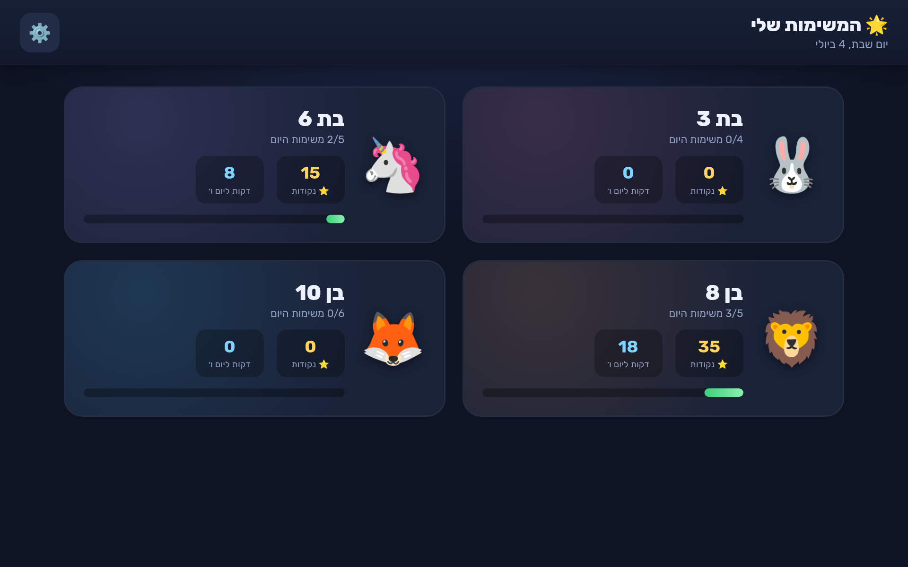
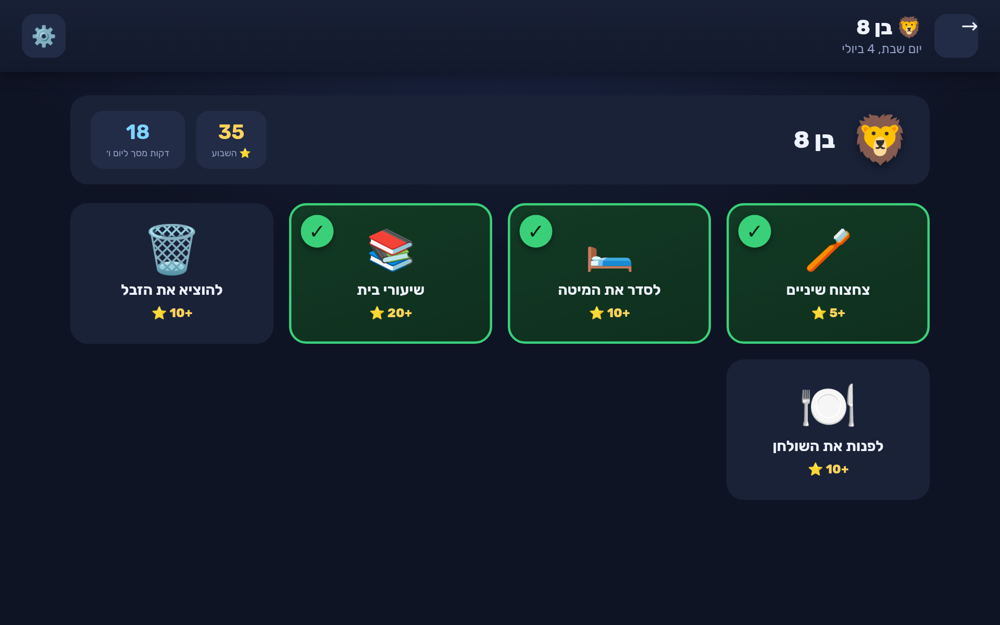

# 🌟 Mes Missions — Tableau de tâches enfants

Application web tactile pour un écran mural familial : chaque enfant voit ses missions,
les coche librement, gagne des points, et convertit ses points en **temps d'écran le vendredi**.
Un **espace parents** (code PIN) permet de suivre, régler le barème et éditer les missions.

Pensée pour une **tablette murale / moniteur tactile en mode kiosque**. 100 % front-end,
aucune base de données : les données sont stockées en local (`localStorage`) sur l'appareil.

## Fonctionnalités
- 4 profils enfants (avatars, couleurs, missions calibrées par âge — tout en icônes pour les non-lecteurs)
- Coche tactile avec gros boutons + animation d'étoile
- Points → minutes d'écran (barème et plafond réglables)
- Badge automatique « 🎉 Jour des récompenses ! » le vendredi
- Espace parents (PIN par défaut **1234**) : récap points/minutes, réinitialiser la semaine,
  éditer missions/points/prénoms/emojis, régler le barème et le code

## Utilisation
Ouvrir `index.html` dans un navigateur. Sur la tablette murale, lancer en plein écran (mode kiosque).

## Stack
Un seul fichier `index.html` — HTML + CSS + JavaScript vanilla. Zéro dépendance, zéro build.

## Aperçu

